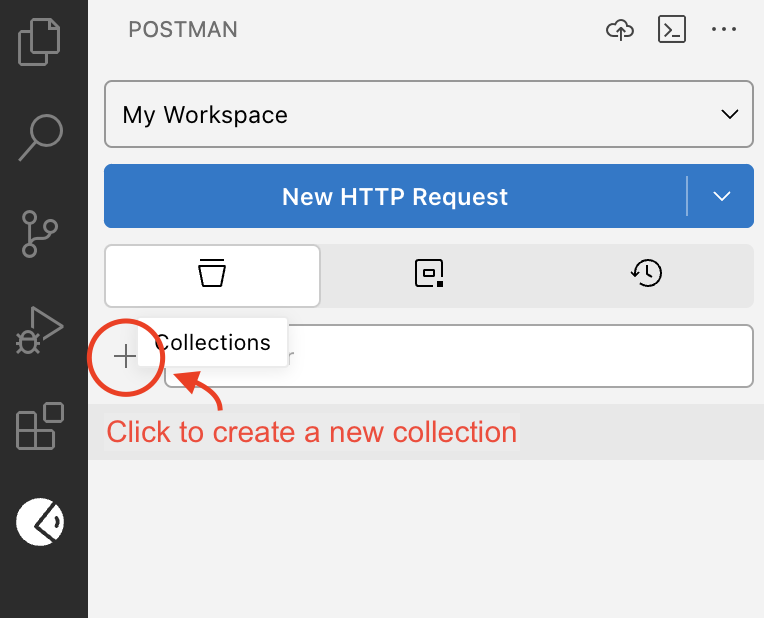
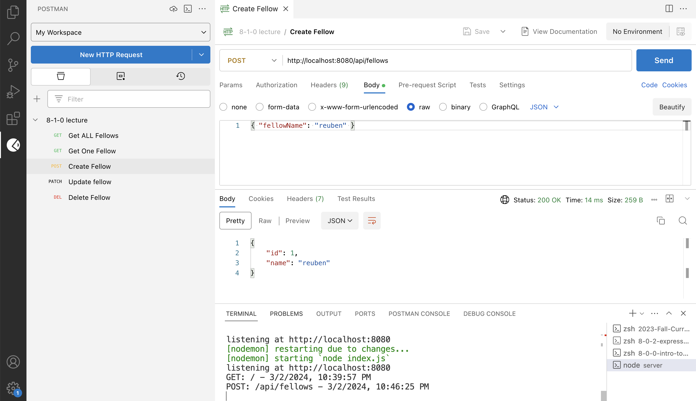

# Model - Controller Design

- [Terms](#terms)
- [Model-Controller Design](#model-controller-design)
- [Route Parameters](#route-parameters)
- [Testing With Postman](#testing-with-postman)
- [Challenge](#challenge)

## Terms

**Model** — an interface for managing a data structure. We will implement a model using a `class` with static methods for performing CRUD actions on a set of data.
**Postman** — a tool for testing HTTP requests
**Route Parameters** — named URL segments that are used to capture the values specified at their position in the URL. The captured values are populated in the `req.params` object

## Model-Controller Design

Here is the structure of the server:

```
server/
├── index.js
├── controllers/
│   └── fellowControllers.js
├── models/
│   └── Fellow.js
└── utils/
    └── fetchData.js
```

* `index.js` builds the `app`, configures middleware, and sets the endpoints. However, the controllers are now imported.
* `controllers/fellowControllers.js` defines all of the controllers for endpoints relating to fellow data. Each set of data should have its own controllers file.
* `models/Fellow.js` defines a model for managing fellow data. This model is used exclusively by the fellow controllers. Each set of data managed by the server should have its own model.


## Route Parameters

https://expressjs.com/en/guide/routing.html#route-parameters

Named URL segments that are used to capture the values specified at their position in the URL. The captured values are populated in the req.params object

```js
// Route path: /users/:userId/books/:bookId
// Request URL: http://localhost:3000/users/34/books/8989
// req.params: { "userId": "34", "bookId": "8989" }

const serveBook = (req, res) => {
  const { userId, bookId } = req.params;
  console.log(userId, bookId); // 34 8989
}

app.get('/users/:userId/books/:bookId', serveBook)
```

## Testing With Postman

* Download the Postman VS Code Extension
* Create an Account on Postman
* Create a collection called `810 lecture`



* Add a request for each of your endpoints:
  * `GET /api/fellows`
  * `GET /api/fellows/:id`
  * `POST /api/fellows`
  * `PATCH /api/fellows/:id`
  * `DELETE /api/fellows/:id`
* Requests that require a body, select the **body** tab, then **raw**, and choose **JSON** from the type dropdown.
* Then, test out your server's endpoints using postman



## Challenge

Build a `Song` model and a server application for maintaining a playlist. Each song should have an `id`, a `title`, and an `artist` (at minimum). The model should provide an interface for:
* Creating a new song
* Getting all songs
* Getting a single song
* Updating the title or artist of a song
* Deleting a song

Then, create an endpoint and a controller for each of these pieces of functionality. The endpoints should follow REST conventions and should all begin with `/api`

Finally, build a frontend react application that can interact with the songs API that you've built. It should be able to:
* Create: Add a new song to the list.
* Read: Display a list of all songs.
* Read: Display a single song.
* Update: Update a single songs's title or artist.
* Delete: Delete a single song.

Here is a recommended page structure for your app:
* `/`: The homepage which includes:
  * Form for creating a new song
  * List of all songs
* `/songs/:id`: The details of a single song which includes
  * The title, artist, and ID of the song
  * A form to submit a new title or artist for the song
  * A button to delete the song from the list

